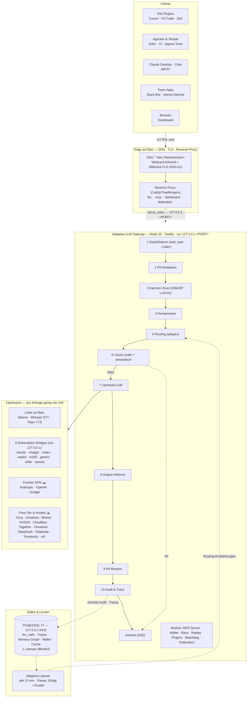

# Beo — Infrastruktur & Subdomain-Plan

> Betriebs-Doku für den Server **Beo**, auf dem der Adaptive LLM Gateway läuft.
> **Hinweis:** Dieses Repo ist öffentlich — Domain und Ports sind hier bewusst
> Platzhalter/Beispielwerte. Die konkreten Werte (`<basisdomain>`, Ports) werden
> in der privaten `.env` bzw. der Proxy-Konfiguration gepflegt, analog zu
> `.env.example`.

## Gesamtbild

## Wie eine Anfrage durch Beo läuft

1. **Eingang** — Client ruft eine Subdomain auf; der Reverse Proxy terminiert TLS und
   reicht an das Gateway auf `127.0.0.1:<PORT>` weiter. Das Gateway lauscht nie direkt im Netz.
2. **Klassifizieren** — `task_type`- und Caller-Erkennung (Rate-Limits, erlaubte Tasks, Modellwahl).
3. **PII-Redaktion** — E-Mails, Telefonnummern, IBANs, Kreditkarten, Keys, JWTs → Platzhalter,
   bevor irgendetwas Beo verlässt (Modi: `off` / `cloud_only` / `always`).
4. **Injection-Scan** — 20+ OWASP-LLM-01-Muster (DE+EN), <5 ms; `warn` oder `block` (HTTP 422).
5. **Kompression** — Prompts ab `LLM_GATEWAY_MIN_TOKENS` Richtung `LLM_GATEWAY_TARGET_TOKENS`.
6. **Routing** — Learner-Empfehlungen + `routing-rules.yaml` wählen das Pareto-beste Modell;
   das Subscription-Wallet prüft die Rest-Quota des Abos.
7. **Cache** — exakter oder semantischer Treffer → Antwort ohne Upstream-Call.
8. **Upstream-Call** — genau ein Ziel: Ollama lokal, eine der 8 Subscription-Bridges (OAuth
   der Flatrate-Abos, kein API-Key) oder externe APIs (nur redigierte Prompts).
9. **Rückweg** — Output-Defense überwacht den Stream (Abbruch bei Secret-Leaks),
   PII-Restore setzt Originaldaten ein, Antwort geht als SSE an den Client.
10. **Lernen** — Audit + Reasoning-Traces nach PostgreSQL; alle 15 min aktualisiert der
    Learner die Routing-Empfehlungen. Optional: Federation teilt anonymisierte Stats mit Peers.

## Subdomains für den neuen Server

Empfehlung: einmalig `*.beo.<basisdomain>` als Wildcard-A/AAAA-Record auf die Server-IP
plus Wildcard-Zertifikat (Let's Encrypt DNS-01) — danach braucht keine Subdomain einen
weiteren DNS-Antrag, es genügt ein vHost im Reverse Proxy.

### P1 — sofort

| Subdomain | Weiterleitung auf (Endpunkt) | Zweck · Pfade | Zugriff |
|---|---|---|---|
| `llm.beo.<basisdomain>` | `http://127.0.0.1:<PORT>` | Haupt-API: `/v1/chat/completions`, `/v1/messages`, `/v1/responses`, `/v1/completion`, `/v1/embeddings`, `/v1/audio/*`, `/v1/race`, `/v1/batch`, `/v1/replay`, `/v1/models`, `/health` | öffentlich · TLS |
| `mcp.beo.<basisdomain>` | `http://127.0.0.1:<PORT>/mcp` | MCP für Claude Desktop, Cursor, Zed, Cline: `/mcp` + `/mcp/sse` | Team · TLS |
| `dashboard.beo.<basisdomain>` | `http://127.0.0.1:<PORT>/` | Dashboard-UI + `/api/dashboard/*` + `/api/stream/*` (SSE) | intern/VPN + `DASHBOARD_AUTH_TOKEN` |

### P2 — zeitnah

| Subdomain | Weiterleitung auf (Endpunkt) | Zweck | Zugriff |
|---|---|---|---|
| `ollama.beo.<basisdomain>` | `http://127.0.0.1:11434` | Direktzugriff lokale Modelle (Debug, `ollama pull`) | intern/VPN |
| `whisper.beo.<basisdomain>` | `http://127.0.0.1:<WHISPER_PORT>` | Whisper.cpp-Server, STT-Backend (`WHISPER_URL`) | intern/VPN |
| `piper.beo.<basisdomain>` | `http://127.0.0.1:<PIPER_PORT>` | Piper-Server, TTS-Backend (`PIPER_URL`) | intern/VPN |
| `federation.beo.<basisdomain>` | `http://127.0.0.1:<PORT>/v1/federation/ingest` | Peer-Stats-Ingest — nur bei `FEDERATION_ENABLED=1` | öffentlich bei Peers |

### P3 — optional, nur bei Multi-Host-Setup

Die 8 Subscription-Bridges (`claude`, `chatgpt`, `codex`, `copilot`, `m365`, `gemini`,
`aider`, `openai`) erreicht das Gateway über `127.0.0.1:<BRIDGE_PORT>` — im Normalfall
brauchen sie **keine** Subdomains. Falls doch (zweiter Host): je Bridge
`<name>-bridge.beo.<basisdomain>` → `http://127.0.0.1:<BRIDGE_PORT>`, strikt **nur per VPN**.

### Niemals

- **Keine** Subdomain für PostgreSQL (`db.` / `postgres.`) — die DB bleibt auf
  `127.0.0.1:5432` bzw. im Docker-Netz (enthält Audit-Log inkl. wiederhergestellter PII).
- Bridges nie öffentlich — sie haben keine eigene Auth; wer sie erreicht, verbraucht Abo-Quota.
- Firewall: nur 80/443 (+ VPN) nach außen; Gateway-, Bridge-, Whisper-/Piper-, Ollama- und
  Postgres-Ports bleiben localhost-only.

## Checkliste fürs Aufsetzen

1. Wildcard-DNS `*.beo.<basisdomain>` → Server-IP (A/AAAA)
2. Wildcard-Zertifikat (Let's Encrypt DNS-01) oder per-Host-Zertifikate im Proxy
3. Proxy-vHosts für `llm.`, `mcp.`, `dashboard.` (P1)
4. `DASHBOARD_AUTH_TOKEN` + `GATEWAY_CORS_ORIGINS` in der `.env` setzen
5. Firewall prüfen (nur 80/443 + VPN offen)
6. P2 nach Bedarf: `ollama.`, `whisper.`, `piper.`, ggf. `federation.`

---

Quellen: `README.md`, `.env.example`, `docker-compose.yaml`,
`packages/gateway/src/` (Routen, Module, Subscription-Katalog).
Eine gerenderte Fassung (Diagramm + Subdomain-Liste als PDF, mit konkreten Werten)
wird separat intern verteilt.
